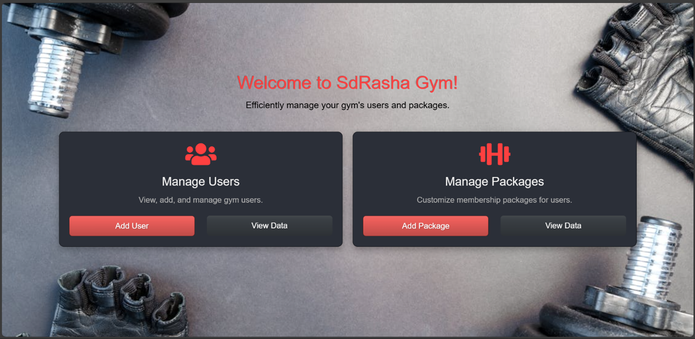
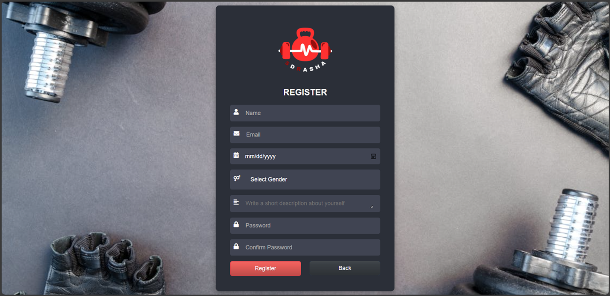
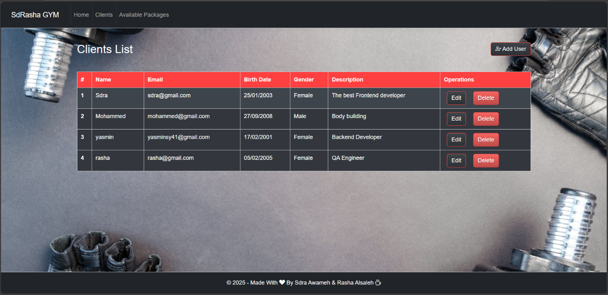
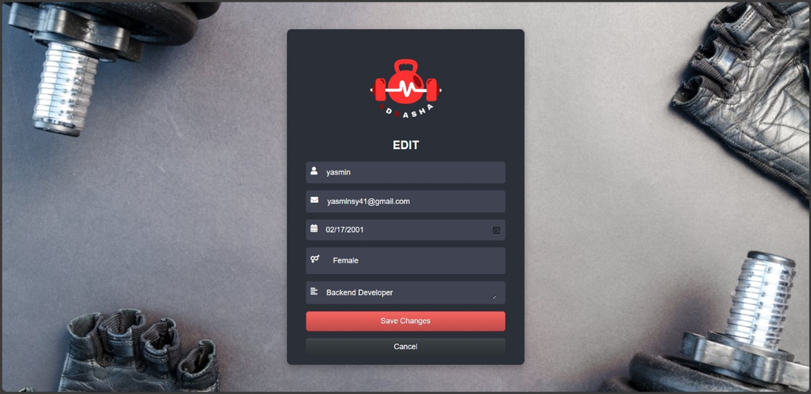
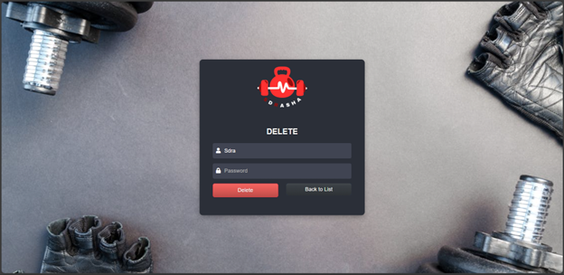
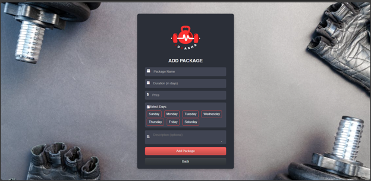

---


---

# SdRasha GYM

**SdRasha GYM** is a CRUD-based Gym Management System built with **.NET Core (C#)** and **SQL Server**. It was developed as a final project for the "Database Programming" course at the Faculty of Information Technology, designed to demonstrate practical database and software development skills. This system provides gym owners with a user-friendly dashboard to manage clients and packages efficiently, replacing traditional manual methods.

---

## Table of Contents
- [Overview](#-overview)
- [Features](#-features)
- [Technologies Used](#️-technologies-used)
- [Getting Started](#-getting-started)
- [User Interface](#-user-interface)
- [Contributors](#-contributors)

---

## Overview

Gym owners often face difficulties managing memberships and packages through paper-based or inefficient systems. SdRasha GYM aims to solve this problem by providing a centralized platform for handling users, gym packages, and instructors. Although it’s a course-based prototype, it serves as a foundational example of how modern management systems can be designed using robust database technologies and clean architecture.

---

## Features

### User Management
- Add, update, delete, and search client records.
- Store detailed info: name, email, phone, DOB, gender, description, profile image.
- Signup/login functionality with email/password validation.

### Package Management
- Admins can create, edit, and delete gym packages.
- View all available packages with full details (price, duration, days).

### Instructor Integration
- Instructors can view their assigned classes and sessions.

---

## Technologies Used

| Tech Stack    | Description                              |
|---------------|------------------------------------------|
| .NET Core     | Backend framework for handling APIs      |
| C#            | Main programming language                |
| SQL Server    | Relational database for storing data     |
| HTML/CSS/JS   | Frontend interface and styling           |
| Bootstrap     | Responsive UI components (optional)      |

---

## Getting Started

### Prerequisites
- [.NET SDK 6.0+](https://dotnet.microsoft.com/en-us/download)
- [SQL Server](https://www.microsoft.com/en-us/sql-server/)
- Any IDE like **Visual Studio 2022** or **Rider**

### Steps

1. **Clone the Repo**
```bash
git clone https://github.com/rasha-2k/SdRashaGYM.git
```

2. Set up Database
- Open SQL Server Management Studio.
- Create a new database.
- Run the SQL scripts provided inside the `/Database` folder.

3. Run the Application

Open the solution file `.sln` in Visual Studio.

Press `F5` or run the application from the terminal:
```bash
dotnet run
```

## User Interface
Screenshots of the UI will be added here to demonstrate:

Here are some screenshots showcasing the user interface of SdRasha GYM:

### Home Page
The landing dashboard with quick access to user and package management.
<p align="left">
  
</p>

---

### Register User
A form for registering a new gym member.
<p align="left">
  
</p>

---

### Client List
Table view of all registered clients with edit/delete options.
<p align="left">
  
</p>

---

### Edit Client
An edit form pre-filled with existing client data.
<p align="left">
  
</p>

---

### Delete Client
Confirmation screen for deleting a user.
<p align="left">
  
</p>

---

### Add Package
A form to create new gym membership packages.
<p align="left">
  
</p>

---

## Contributors
<div style="display: flex; align-items: center; margin-bottom: 20px;">
    <a href="https://github.com/rasha-2k" style="text-decoration: none; display: flex; align-items: center;">
        
    </a>
    <a href="https://github.com/Sdra-Awameh" style="text-decoration: none; display: flex; align-items: center;">
        
    </a>
</div>
